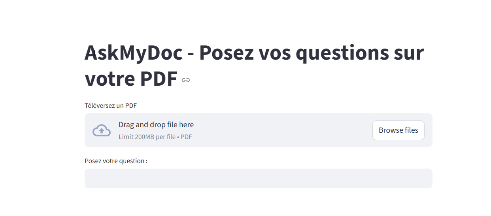

# AskMyDoc

## Description

AskMyDoc est une application Streamlit qui aide à poser des questions sur le contenu d’un fichier PDF. L’application charge le document, extrait le texte et le convertit en embeddings, puis interroge un modèle OpenAI pour générer une réponse basée sur les passages pertinents. Le modèle OpenAI ne construit pas l’application ; il fournit les réponses à partir des données extraites et indexées par le pipeline.

## Fonctionnalités

- Téléversement d’un PDF
- Extraction et découpe du texte
- Indexation en vecteurs avec Chroma
- Recherche des passages pertinents par similarité
- Génération de la réponse via un modèle OpenAI
- Affichage des sources et pages utilisées
- Évaluation de la qualité de la recherche sur un jeu de questions de référence

## Installation

1. Créer et activer un environnement virtuel Python :

```powershell
python -m venv venv
.\venv\Scripts\Activate.ps1
```

2. Installer les dépendances :

```powershell
pip install -r requirements.txt
```

3. Créer un fichier `.env` à la racine du projet :

```text
OPENAI_API_KEY=ton_api_key_openai
```

4. Vérifier que le fichier `.gitignore` contient au moins :

```text
venv/
.env
```

## Utilisation

Lancer l’application Streamlit :

```powershell
streamlit run app.py
```

Puis :

1. Ouvrir l’URL fournie par Streamlit.
2. Téléverser un fichier PDF.
3. Poser une question dans le champ.
4. Consulter la réponse et les sources.

## Aperçu de l’interface



## Évaluation de la recherche

### Méthode

Pour mesurer la qualité de la recherche, j’ai construit un jeu de test :

- un document de test de 10 pages (guide interne d’une PME fictive) : `eval/guide_atelier_verdane.pdf` ;
- 20 questions de référence, avec la page où se trouve la réponse : `eval/questions.json`. Elles sont formulées avec d’autres mots que ceux du document, comme le ferait un vrai utilisateur ;
- 4 questions dont la réponse n’est pas dans le document, pour vérifier que l’application répond qu’elle ne sait pas.

**Métrique** : pour chaque question, on vérifie si la page contenant la réponse fait partie des passages récupérés (taux de réussite).

Lancer l’évaluation :

```powershell
python eval_retrieval.py
```

### Résultats

| Configuration | Morceaux | Réussite |
|---|---|---|
| Initiale (500 caractères, k=3, MMR) | 26 | 18/20 (90 %) |
| **Similarité simple** | 26 | **20/20 (100 %)** |
| MMR avec k=5 | 26 | 19/20 (95 %) |
| Morceaux de 1 000 caractères | 15 | 18/20 (90 %) |

### Analyse des erreurs

- **Vocabulaire différent** : « Dans quel logiciel poser mes vacances ? » échoue avec MMR, car le document parle de « congés ».
- **Confusion sur la forme** : pour « Quelles plages horaires sont obligatoires ? », le passage le plus proche était une autre plage horaire (permanence du CSE, de 12 h à 14 h).
- **Dilution** : avec des morceaux de 1 000 caractères, l’indemnité de télétravail est noyée dans un passage qui traite aussi des horaires et des équipes.
- **MMR** : en cherchant à diversifier les passages, MMR sélectionne des fragments de fin de page peu utiles. Dans ce document, chaque information n’apparaît qu’une fois : il n’y a pas de redondance à éliminer.

**Choix retenu** : la similarité simple, désormais utilisée par l’application.

### Limites et pistes d’amélioration

- 20 questions sur un document propre : un document réel (PDF scannés, tableaux complexes, centaines de pages) serait plus difficile.
- L’évaluation porte sur la recherche. Les réponses générées ont été relues manuellement ; l’étape suivante est un LLM juge avec une grille explicite (ou des métriques comme celles de RAGAS), en vérifiant ses notes sur un échantillon.
- Pistes : nettoyer les pieds de page à l’extraction, fusionner les fragments trop courts, tester une recherche hybride (vecteurs + mots-clés) et un reranking.

## Structure du projet

- `app.py` - application Streamlit principale
- `utils/pdf_loader.py` - charge le PDF et extrait le contenu
- `utils/doc_splitter.py` - découpe le document en chunks
- `utils/embeddings.py` - initialise le modèle d’embeddings OpenAI
- `utils/vectorstore.py` - crée le vectorstore Chroma
- `utils/qa_chain.py` - construit la chaîne de Q&A
- `eval_retrieval.py` - évalue la qualité de la recherche et compare plusieurs configurations
- `eval/guide_atelier_verdane.pdf` - document de test
- `eval/questions.json` - questions de référence avec réponses et pages attendues

## Remarques

- Ne jamais committer le fichier `.env` sur GitHub.
- Si GitHub bloque le push, vérifie que `.env` n’est pas présent dans l’historique Git et que `.gitignore` est bien configuré.
- Tu peux adapter le modèle OpenAI ou les paramètres de découpe selon tes besoins.
