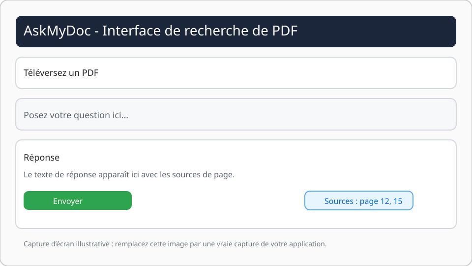

# AskMyDoc

## Description

AskMyDoc est une application Streamlit qui aide à poser des questions sur le contenu d’un fichier PDF. L’application charge le document, extrait le texte et le convertit en embeddings, puis interroge un modèle OpenAI pour générer une réponse basée sur les passages pertinents. Le modèle OpenAI ne construit pas l’application ; il fournit les réponses à partir des données extraites et indexées par le pipeline.

## Fonctionnalités

- Téléversement d’un PDF
- Extraction et découpe du texte
- Indexation en vecteurs avec Chroma
- Recherche de réponses via un modèle OpenAI
- Affichage des sources et pages utilisées

## Installation

1. Créer et activer un environnement virtuel Python :

```powershell
python -m venv venv
.\venv\Scripts\Activate.ps1
```

2. Installer les dépendances :

```powershell
pip install -r requirements.txt
```

3. Créer un fichier `.env` à la racine du projet :

```text
OPENAI_API_KEY=ton_api_key_openai
```

4. Vérifier que le fichier `.gitignore` contient au moins :

```text
venv/
.env
```

## Utilisation

Lancer l’application Streamlit :

```powershell
streamlit run app.py
```

Puis :

1. Ouvrir l’URL fournie par Streamlit.
2. Téléverser un fichier PDF.
3. Poser une question dans le champ.
4. Consulter la réponse et les sources.

## Aperçu de l’interface



> Exemple de capture d’écran illustrant l’interface. Remplacez cette image par une capture réelle de votre application pour un aperçu plus fidèle.

## Structure du projet

- `app.py` - application Streamlit principale
- `utils/pdf_loader.py` - charge le PDF et extrait le contenu
- `utils/text_splitter.py` - découpe le document en chunks
- `utils/embeddings.py` - initialise le modèle d’embeddings OpenAI
- `utils/vectorstore.py` - crée le vectorstore Chroma
- `utils/qa_chain.py` - construit la chaîne de Q&A

## Remarques

- Ne jamais committer le fichier `.env` sur GitHub.
- Si GitHub bloque le push, vérifie que `.env` n’est pas présent dans l’historique Git et que `.gitignore` est bien configuré.
- Tu peux adapter le modèle OpenAI ou les paramètres de découpe selon tes besoins.


